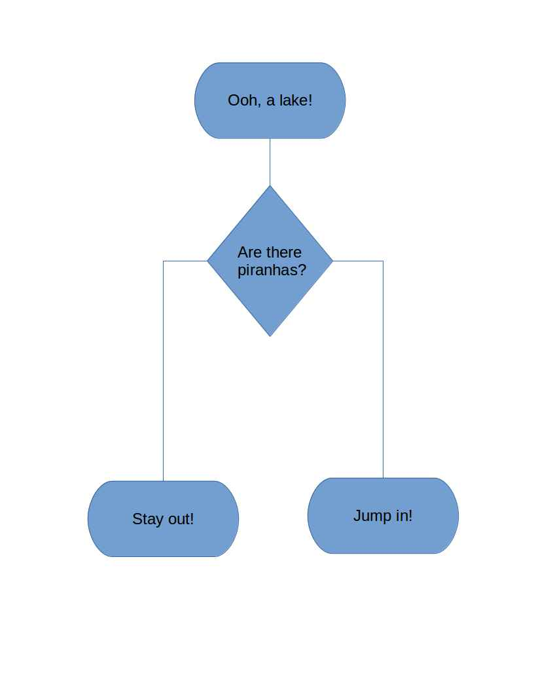
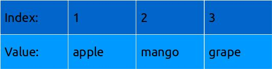
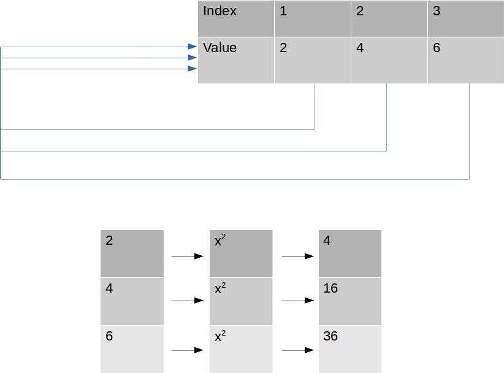

Branching Logic and Loops
========================================================
author: Colin Pistell
date: 9/17/2015

Bread and Butter
========================================================

Branching logic and looping are the heart and soul of coding. It's basically why coding is 'useful'. If you understand these two things you can code just about anything... 

- ...not necessarily optimally, but who cares?

Ifs, Thens, and Elses
========================================================

The basic idea of branching logic is we may want different things to happen under different circumstances.

- How would you like to swim in a beautiful pristine lake?
- What if it's filled with piranhas?


The Branch
========================================================



***

- Branching always begins with a boolean, or TRUE/FALSE question
- If the answer is TRUE you do one thing
- If the answer is FALSE you do something else

How It Looks in R
=======================


```r
areTherePiranhas <- TRUE

if(areTherePiranhas == TRUE) {
    print("Maybe I'll stay out of the lake...")
} else {
    print("Woohoo! Time to swim!")
}
```

```
[1] "Maybe I'll stay out of the lake..."
```

Multiple Branches: else if
=============================


```r
areTherePiranhas <- FALSE
areThereSnakes <- TRUE

if (areTherePiranhas == TRUE) {
    print("Maybe I'll stay out of the lake...")
} else if(areThereSnakes == TRUE) {
    print("Snakes... why'd it have to be snakes...")
} else {
    print("Woohoo! Time to swim!")
}
```

```
[1] "Snakes... why'd it have to be snakes..."
```

What's Happening Here?
=========================


```r
x <- 1

if(x < 2) {
    print("duck 1")
} else if( x < 5) {
    print("duck 2") 
} else {
    print("goose!")
}
```

```
[1] "duck 1"
```

Loops: Where Things Get Serious
===================================

Looping allows us to execute the same piece of code over each element in a collection of things

- Imagine if you had to rename a bunch of text files to begin with the date they were created...
- If there are just a couple then this is no big deal. But what if there are hundreds? Or thousands? Or millions?
- Doing it by hand is infeasible. But a piece of looping code could do it almost instantly.

The Two Main types of Loops
============================

- There are two main types of loops: While loops and For loops.
- While loops execute a piece of code *while* a particular logical condition is true.
- For loops execute a piece of code *for* each item in a given group.
- For loops are way more common and useful for our purposes. 

Anatomy of a Loop
==================

Consider this example:


```r
x <- 1:3 #x is now a vector of 1,2,3

for(i in x) {
    print(i + 1)
}
```

```
[1] 2
[1] 3
[1] 4
```

Anatomy of a Loop
==================

- "i" is our iteration variable. It keeps track of where we are in the group and takes on the value of whatever the value of that particular object in the group.
- The first time through our example loop, "i" is equal to the first element in the vector x, which is 1.
- Next the code contained within the loop executes. But it's not done yet...


Anatomy of a Loop
==================

- The next time through the loop, "i" takes on the value of the next element in the vector x, which is 2.
- The code contained within the loop now runs again, but this time i=2, so the result is going to be a little different.
- The loop continues until "i" has taken on every sequential value of the group you've specified.

"i" Can Be a Pure Counter
==========================


```r
x <- 1:3
for(i in x) {
    print("foo")
}
```

```
[1] "foo"
[1] "foo"
[1] "foo"
```

"i" Can Be Named Anything Really...
======================================


```r
tacoTruckInventory <- 5
for(taco in 1:tacoTruckInventory) {
    print("<burp> Yum!")
}
```

```
[1] "<burp> Yum!"
[1] "<burp> Yum!"
[1] "<burp> Yum!"
[1] "<burp> Yum!"
[1] "<burp> Yum!"
```

- "i" and "j" are traditional choices.

A Bit Trickier: Looping Via Index
==================================

Take a look at the next two loops. What will their output be?


```r
fruits <- c("apples", "mangos", "grapes")
```


```r
for(i in fruits) {
    print(paste("I like", i))
}
```


```r
for(i in 1:length(fruits)) {
    print(paste("I like", fruits[i]))
}
```

Looping Via Index cont.
===========================

They result in the same output. The only difference is that in the second example "i" was set to the index of the object in the vector instead of the object itself.


A Vector and Its Index
=========================



Recall that each object in a vector has an index value:


```r
fruits[1]
```

```
[1] "apples"
```

```r
fruits[length(fruits)]
```

```
[1] "grapes"
```

Looping Via Index cont.
=========================

So why loop via index? Isn't it needlessly complicated?

- There will be times when having your iterator set to an index value is incredibly useful.
- Think about if you want to look at objects in a vector, do something with them, and *save the result in a new vector.*
- Turns out, it's way more efficient and faster to loop via index.

Example: Finding Squares
=========================

Let's say we want to find the squares of a vector of numbers and save the output to a new vector. We could do this:


```r
toSquare <- c(2, 4, 6)
answers <- NULL #we need to initialize our answer vector

for(i in toSquare) {
    answers <- c(answers, i^2)
}

answers
```

```
[1]  4 16 36
```

Inefficient!
==============

The previous example works, but there are some problems

- Every time we run through the loop, the code has to concatenate our existing answer vector with our new answer.
- This "growing" of vectors is computationally extremely inefficient.
- For small vectors you won't notice, but when you're dealing with thousands (or millions) of objects things can grind to a halt.

Let's try again but this time loop via index...

Better
=========


```r
toSquare <- c(2, 4, 6)
answers <- rep(NA, length(toSquare)) #instantly create a vector of the correct size

for(i in 1:length(toSquare)) {
    answers[i] <- toSquare[i]^2
}

answers
```

```
[1]  4 16 36
```

...Faster Stronger?
===================

- Turns out the second solution is way more efficient.
- So should you always loop via index? Not necessarily...
- In this past example it works better. But in other cases it may not - and it's a bit more complicated.
- Practice and experience will help you figure out how to construct your loops...
- ...if you even *need* loops...

Vectorized Code!
==================

- It turns out that loops in R are, relatively speaking, pretty slow
    - This is not true for lower-level compiled languages like C
- In most cases, if you're clever, you can set up your code to take advantage of *vectorized operations*.
- Consider our last example. We could have solved it with no loops at all, just like this:


```r
toSquare <- c(2, 4, 6)
thatWasEasy <- toSquare^2
thatWasEasy
```

```
[1]  4 16 36
```

Loops vs. Vectorization
=========================



The Right Tool For the Job
===========================

- There's a somewhat cheeky saying among R programmers: If you're using a For Loop, something has gone wrong.
    - I must once again emphasize that this is NOT true for most other languages!
- Certainly there's an element of truth in this - For Loops are not very fast or efficient - but sometimes they're the right tool for the job. So use them.
- If you want faster looping, check out the Apply function family (apply, lapply, sapply, tapply)
    - loops are executed in C, so they're quite a bit faster
- Go for vectorized solutions whenever possible!

A Final Example: Putting Everything Together
=============================================


```r
for(i in 1:length(fruits)) {
    if(i < 3) {
        print(paste("Yum, ", fruits[i], "!", sep = ""))
    } else {
        print("I'm full...")
    }
}
```

```
[1] "Yum, apples!"
[1] "Yum, mangos!"
[1] "I'm full..."
```

